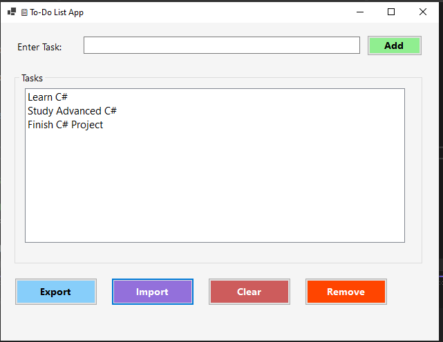

# 🖥️ To-Do List - Windows Forms Application

A simple **C# Windows Forms application** developed as part of the **CodVeda Internship Task**.  
This project extends the functionality of the console-based To-Do List app into a **GUI desktop application** using Windows Forms.

---

## 🚀 Features
- ➕ Add new tasks  
- 📋 List all tasks  
- ❌ Remove selected task  
- 🧹 Clear all tasks  
- 📤 Export tasks to a text file (`tasks.txt`)  
- 📥 Import tasks from a text file (`tasks.txt`)  
- 🎨 Enhanced design with **different button colors** for better user experience  

---

## 🖼️ Screenshots

Here’s how the application looks:  

  

---

## 🛠️ Technologies Used
- C#  
- .NET Framework (Windows Forms)  
- System.IO (for file handling)  

---

## 📂 Project Structure
- **Form1.cs** → Core logic and UI design (created fully in code, not drag & drop)  
- **Program.cs** → Entry point of the application  
- **tasks.txt** → Stores exported/imported tasks  

---

## 📥 Download & Run
You can download the latest version of the application from the Release section:

[Download To-Do List - Windows Forms](https://github.com/YourUsername/ToDoList-WinForms/releases)

---

## 🖥️ How to Run
1. Download the `.zip` file from the release section.  
2. Extract the contents.  
3. Run the `ToDoListWinForms.exe` file.  
4. Start adding, removing, importing, or exporting tasks using the buttons.  

---

## 🎯 Learning Outcomes
From this task, I learned:
- How to build **Windows Forms applications** in C#.  
- How to design UI **fully with code** (no drag & drop).  
- How to implement **event-driven programming**.  
- File handling (import/export).  
- Difference between **Console Apps** and **Windows Forms Apps**.  

---

## 👤 Author
- **Ahmed Ayman**  
- 📧 Email: [aymanahmed630@gmail.com](mailto:aymanahmed630@gmail.com)  
-   

